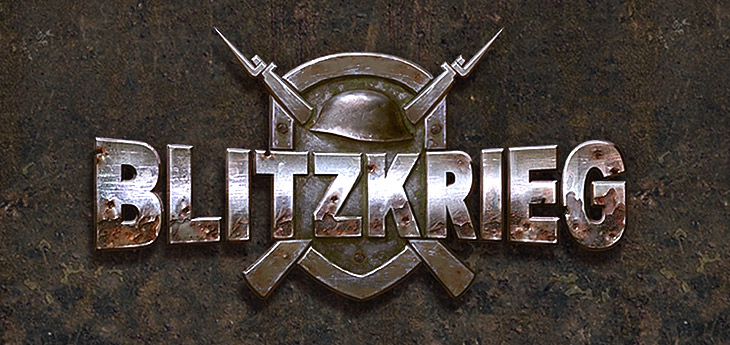

[](https://www.youtube.com/watch?v=zNxMvTcsJbk)

The computer game [Blitzkrieg](https://wikipedia.org/wiki/Blitzkrieg_(video_game)) is the first installment of the legendary series of real-time strategy war games, developed by [Nival Interactive](http://nival.com/) and released on March 28, 2003.

The game is still available on [Steam](https://store.steampowered.com/app/313480/Blitzkrieg_Anthology/) and [GOG.com](https://www.gog.com/en/game/blitzkrieg_anthology).

In 2025, the game's singleplayer source code was released under a [special license](LICENSE.md) that prohibits commercial use but is completely open for the game's community, education and research.
Please review the terms of the [license agreement](LICENSE.md) carefully before using it.

# Done changes
- Changes were mostly done so that the project can compile in Visual C++ 6.0 on Windows 10
- Removed all post-link CMD commands from projects - they didn't work on Windows 10
- Changed a few headers, predominantly SFX - "ported" to FMOD 3.75 - it seems to work
- Added FFMPEG video player (replacing BINK) - older 0.10.1 version, it supports bink, as well as some modern formats like MP4 or WEBM, x264 codec
- Some additional cleanups were made too
- I don't plan on working on this anymore tbh, I'll wait for Blitzkrieg 2 source code since I love that game a lot

# What is in this repository
- `Data` - game data
- `Soft` and `Tools` - development tools
- `Versions` - compiled versions of the game, including map editors
- `Sources` - source code and tools

# Preparation

All libraries from the SDK directory are needed for compilation. The paths to them must be entered in **Tools => Options => Directories** in the following order:

## Include
```
C:\SDK\DX81\DXF\DXSDK\INCLUDE
C:\SDK\FMOD\INCLUDE (not included in the repository)
C:\PROGRAM FILES\MICROSOFT VISUAL STUDIO\VC98\STLPORT
C:\SDK\BINK (not included in the repository)
C:\SDK\S3TC
C:\SDK\Maya4.0\include
C:\PROGRAM FILES (X86)\MICROSOFT VISUAL STUDIO\VC98\INCLUDE
C:\PROGRAM FILES (X86)\MICROSOFT VISUAL STUDIO\VC98\MFC\INCLUDE
C:\SDK\VTUNEAPI
C:\SDK\FFMPEG\INCLUDE
```

## Lib
```
C:\SDK\DX81\DXF\DXSDK\LIB (not included in the repository)
C:\Program Files (x86)\Microsoft Visual Studio\VC98\LIB
C:\Program Files (x86)\Microsoft Visual Studio\VC98\MFC\LIB
C:\SDK\MSXML
C:\SDK\MAYA4.0\LIB
C:\SDK\S3TC
C:\SDK\VTUNEAPI
C:\SDK\FMOD\LIB
C:\SDK\BINK
C:\SDK\FFMPEG\LIB
```

### Important Notes

- **Bink, FMOD, Stingray** libraries are not included in this repository as they require separate licensing.
- **stlport** *must* be located in the Visual C directory, alongside `include`.

---

# Additional Tools

- The **tools** directory contains utilities used during the build process.
- Resources are stored in **zip (deflate)** format and are packed/unpacked using **zip/unzip**.
- **Do not use pkzip** — it truncates file names and does not use the deflate algorithm.
- Some data is edited manually using an **XML-editor**, as frequent editing was not necessary and writing a separate editor was impractical.

---

# Files in `data`

In the game's directory, under **data**, there are files that are manually edited or simply placed:

- `sin.arr` — binary file with a sine table (just place it, do not touch).
- `objects.xml` — registry of game objects (edited manually).
- `consts.xml` — game constants for designers (edited manually).
- `MusicSettings.xml` — music settings (edited manually).
- `partys.xml` — country data (which squad to use for gun crew, parachutist model, etc.).

## Files in `medals`

In the **medals** subdirectory, files `ranks.xml` contain ranks and **experience** needed to obtain them, organized by country.
