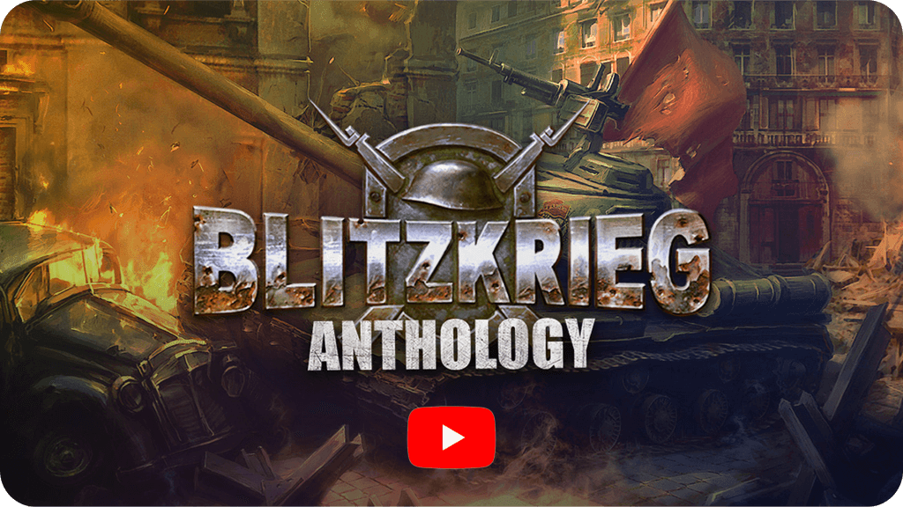

[English](README.md)        [Русский](README_Russian.md)        [中文](README_Chinese.md)        [हिन्दी](README_Hindi.md)        [Español](README_Spanish.md)        [Français](README_French.md)        [Deutsch](README_German.md)        [Português](README_Portuguese.md)        [日本語](README_Japanese.md)        [Bahasa Indonesia](README_Indonesian.md)

[](https://www.youtube.com/watch?v=zNxMvTcsJbk)

Das Computerspiel [Blitzkrieg](https://wikipedia.org/wiki/Blitzkrieg_(video_game)) ist der erste Teil der legendären Echtzeit-Strategiespielserie, entwickelt von [Nival Interactive](http://nival.com/) und am 28. März 2003 veröffentlicht.

Das Spiel ist weiterhin auf [Steam](https://store.steampowered.com/app/313480/Blitzkrieg_Anthology/) und [GOG.com](https://www.gog.com/en/game/blitzkrieg_anthology) erhältlich.

Im Jahr 2025 wurde der Singleplayer-Quellcode des Spiels unter einer [speziellen Lizenz](LICENSE.md) freigegeben, die die kommerzielle Nutzung untersagt, aber vollständig für die Community des Spiels, für Bildungszwecke und Forschung geöffnet ist. 
Bitte lesen Sie die Bedingungen des [Lizenzvertrags](LICENSE.md) sorgfältig durch, bevor Sie ihn verwenden.

# Inhalt dieses Repositories
- `Data` – Spieldaten
- `Soft` und `Tools` – begleitende Entwickler-Tools
- `Versions` – kompilierte Versionen des Spiels, einschließlich Karteneditoren
- `Sources` – Quellcode und Werkzeuge

# Vorbereitung

Alle Bibliotheken aus dem SDK-Verzeichnis werden für die Kompilierung benötigt. Die Pfade zu diesen Bibliotheken müssen in **Tools => Options => Directories** in folgender Reihenfolge angegeben werden:

## Include
```
C:\PROGRAM FILES\MICROSOFT VISUAL STUDIO\VC98\STLPORT
C:\SDK\BINK (nicht im Repository enthalten)
C:\SDK\FMOD\API\INC (nicht im Repository enthalten)
C:\SDK\S3TC
C:\SDK\STINGRAY STUDIO 2002\INCLUDE\TOOLKIT (nicht im Repository enthalten)
C:\SDK\STINGRAY STUDIO 2002\INCLUDE (nicht im Repository enthalten)
C:\SDK\STINGRAY STUDIO 2002\REGEX\INCLUDE (nicht im Repository enthalten)
C:\SDK\Maya4.0\include
```

## Lib
```
C:\SDK\BINK (nicht im Repository enthalten)
C:\SDK\FMOD\API\LIB (nicht im Repository enthalten)
C:\SDK\S3TC
C:\SDK\STINGRAY STUDIO 2002\LIB (nicht im Repository enthalten)
C:\SDK\STINGRAY STUDIO 2002\REGEX\LIB (nicht im Repository enthalten)
C:\SDK\Maya4.0\lib
```

Zusätzlich wird **DirectX 8.1** oder höher benötigt (wird automatisch zu den Pfaden hinzugefügt).

### Wichtige Hinweise

- Die Bibliotheken **Bink, FMOD, Stingray** sind nicht in diesem Repository enthalten, da sie eine separate Lizenzierung erfordern.
- **stlport** *muss* sich im Visual C-Verzeichnis neben `include` befinden.
- Der Pfad `C:\PROGRAM FILES\MICROSOFT VISUAL STUDIO\VC98\STLPORT` muss **zuerst** stehen, sonst schlägt die Kompilierung fehl.

---

# Zusätzliche Werkzeuge

- Im Ordner **tools** befinden sich die beim Kompilieren verwendeten Hilfsprogramme.
- Ressourcen werden im **zip (deflate)**-Format gespeichert und mit **zip/unzip** gepackt bzw. entpackt.
- **Verwenden Sie kein pkzip** — es kürzt Dateinamen und verwendet nicht den Deflate-Algorithmus.
- Einige Daten werden manuell mit einem **XML-Editor** bearbeitet, da häufiges Bearbeiten nicht nötig war und ein eigener Editor nicht sinnvoll gewesen wäre.

---

# Dateien in `data`

Im Verzeichnis des Spiels, unter **data**, befinden sich Dateien, die manuell bearbeitet oder einfach abgelegt werden müssen:

- `sin.arr` — Binärdatei mit Sinustabelle (einfach ablegen, nicht bearbeiten).
- `objects.xml` — Verzeichnis der Spielobjekte (manuell bearbeiten).
- `consts.xml` — Spielkonstanten für Designer (manuell bearbeiten).
- `MusicSettings.xml` — Musik-Einstellungen (manuell bearbeiten).
- `partys.xml` — Länderdaten (welcher Trupp für Geschützbedienung, Modell des Fallschirmspringers usw.).

## Dateien in `medals`

Im Unterverzeichnis **medals** befinden sich, nach Ländern sortiert, die Dateien `ranks.xml`, die Dienstgrade und die erforderliche **Erfahrung** zum Erreichen enthalten.
