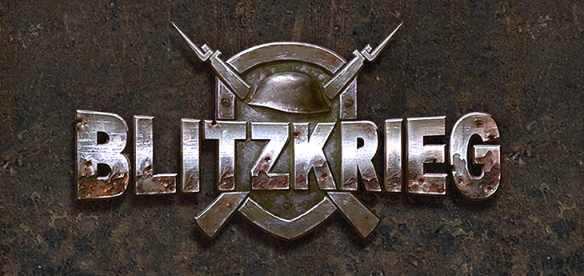

[English](README_English.md)        [Русский](README.md)        [中文](README_Chinese.md)        [हिन्दी](README_Hindi.md)        [Español](README_Spanish.md)        [Français](README_French.md)        [Deutsch](README_German.md)        [Português](README_Portuguese.md)        [日本語](README_Japanese.md)        [Bahasa Indonesia](README_Indonesian.md)

[](https://www.youtube.com/watch?v=zNxMvTcsJbk)

कंप्यूटर खेल [ब्लिट्जक्रेग](https://wikipedia.org/wiki/Blitzkrieg_(video_game)) प्रसिद्ध श्रृंखला की वास्तविक समय की रणनीति युद्ध खेलों का पहला संस्करण है, जिसे [निवाल इंटरएक्टिव](http://nival.com/) द्वारा विकसित किया गया है और 1सी कंपनी द्वारा 28 मार्च, 2003 को जारी किया गया।

यह खेल अब भी [स्टिम](https://store.steampowered.com/app/313480/Blitzkrieg_Anthology/) और [GOG.com](https://www.gog.com/en/game/blitzkrieg_anthology) पर उपलब्ध है।

2025 में, खेल के सिंगलप्लेयर सोर्स कोड को [विशेष लाइसेंस](LICENSE.md) के तहत जारी किया गया था, जो व्यावसायिक उपयोग को निषिद्ध करता है, लेकिन यह खेल के समुदाय, शिक्षा और अनुसंधान के लिए पूरी तरह से खुला है। कृपया इसका उपयोग करने से पहले [लाइसेंस समझौते](LICENSE.md) की शर्तों को ध्यान से पढ़ें।

# इस संग्रह में क्या है
- `Data` - खेल के डेटा
- `Soft` और `Tools` - विकास उपकरण
- `Versions` - खेल के संकलित संस्करण, जिसमें नक्शा संपादक शामिल हैं
- `Sources` - सोर्स कोड और उपकरण

# तैयारी

संकलन के लिए SDK निर्देशिका से सभी लाइब्रेरी की आवश्यकता होती है। उनके रास्तों को **Tools => Options => Directories** में निम्नलिखित क्रम में दर्ज करना होगा:

## Include
```
C:\PROGRAM FILES\MICROSOFT VISUAL STUDIO\VC98\STLPORT
C:\SDK\BINK (संग्रह में शामिल नहीं)
C:\SDK\FMOD\API\INC (संग्रह में शामिल नहीं)
C:\SDK\S3TC
C:\SDK\STINGRAY STUDIO 2002\INCLUDE\TOOLKIT (संग्रह में शामिल नहीं)
C:\SDK\STINGRAY STUDIO 2002\INCLUDE (संग्रह में शामिल नहीं)
C:\SDK\STINGRAY STUDIO 2002\REGEX\INCLUDE (संग्रह में शामिल नहीं)
C:\SDK\Maya4.0\include
```

## Lib
```
C:\SDK\BINK (संग्रह में शामिल नहीं)
C:\SDK\FMOD\API\LIB (संग्रह में शामिल नहीं)
C:\SDK\S3TC
C:\SDK\STINGRAY STUDIO 2002\LIB (संग्रह में शामिल नहीं)
C:\SDK\STINGRAY STUDIO 2002\REGEX\LIB (संग्रह में शामिल नहीं)
C:\SDK\Maya4.0\lib
```

इसके अलावा, **DirectX 8.1** या उच्चतर की आवश्यकता होती है (यह स्वचालित रूप से पथों में जोड़ा जाएगा)।

### महत्वपूर्ण नोट्स

- **Bink, FMOD, Stingray** लाइब्रेरी इस संग्रह में शामिल नहीं हैं क्योंकि उन्हें अलग लाइसेंसिंग की आवश्यकता होती है।
- **stlport** *जरूरी* है कि वह Visual C निर्देशिका में `include` के साथ स्थित हो।
- पथ `C:\PROGRAM FILES\MICROSOFT VISUAL STUDIO\VC98\STLPORT` को **सबसे पहले** होना चाहिए, अन्यथा निर्माण विफल हो जाएगा।

---

# अतिरिक्त उपकरण

- **tools** निर्देशिका में उपयोगिताएँ शामिल हैं जो निर्माण प्रक्रिया के दौरान उपयोग की जाती हैं।
- संसाधन **zip (deflate)** प्रारूप में संग्रहीत होते हैं और **zip/unzip** का उपयोग करके पैक/अनपैक किए जाते हैं।
- **pkzip का उपयोग न करें** — यह फ़ाइल नामों को काट देता है और deflate एल्गोरिथ्म का उपयोग नहीं करता।
- कुछ डेटा को मैन्युअल रूप से एक **XML-संपादक** का उपयोग करके संपादित किया जाता है, क्योंकि बार-बार संपादन आवश्यक नहीं था और एक अलग संपादक लिखना व्यावहारिक नहीं था।

---

# `data` में फ़ाइलें

खेल की निर्देशिका में, **data** के अंतर्गत, कुछ फ़ाइलें हैं जिनका मैन्युअल रूप से संपादन किया जाता है या जिन्हें बस रखा जाता है:

- `sin.arr` — साइन तालिका के साथ बाइनरी फ़ाइल (बस रखें, इसे न छुएं)।
- `objects.xml` — खेल वस्तुओं का रजिस्टर (मैन्युअल रूप से संपादित)।
- `consts.xml` — डिज़ाइनरों के लिए खेल नियम (मैन्युअल रूप से संपादित)।
- `MusicSettings.xml` — संगीत सेटिंग्स (मैन्युअल रूप से संपादित)।
- `partys.xml` — देश डेटा (कौन सा दस्ते तोप दल के लिए उपयोग करें, पैराशूट मॉडल, इत्यादि)।

## `medals` में फ़ाइलें

**medals** उपनिर्देशिका में, देशों के अनुसार `ranks.xml` फ़ाइलें होती हैं, जिनमें रैंक और उन्हें प्राप्त करने के लिए आवश्यक **अनुभव** होता है।
